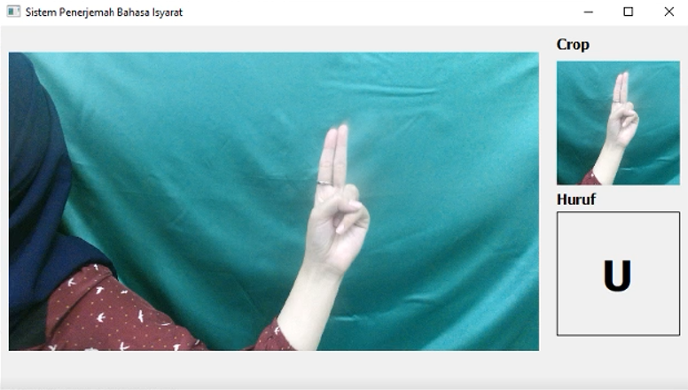

<h1 align="center">Design and Implementation of Sign Language Translator System</h1>
<h3 align="center">This study looks at the development of a sign language translation system that will serve as a communication link between deaf and hearing people. </h3>

## Table of Contents
1. [About the Project](#about-the-project)
2. [Tech Stack](#tech-stack)
3. [System Manufacturing](#system-manufacturing)
4. [Testing](#testing)
5. [Team Member](#team-member)

## About The Project
Communication with deaf people uses the sign language method, and there are two sign language systems in Indonesia, namely BISINDO and SIBI. SIBI is officially used in all special schools based on the regulation of the Ministry of Education of the Republic of Indonesia. Due to the lack of knowledge of sign language in the community, there are still many obstacles to communication between deaf persons and the general public.

This system's development of computer technology, namely image processing to using the Kinect 2.0 camera sensor as a setting for collecting image data. The Convolutional Neural Network (CNN) deep learning model is employed as a classification method in the system architecture since it provides a practical design that makes implementation easier. And this system was built using the Python programming language.

## Tech Stack

## System Manufacturing
Version 3.8 of Python was used to create this system. The Kinect V 2.0 serves as the camera for the images. Using PyQT, the user interfaces are created. And CNN is machine learning chosen in image translation. Below is a screenshot of the system's user interface and simulation.

- <b>Main Menu Interfaces</b>

  
Upade Main Menu Interface

  

- <b>Recognition Interfaces</b>

- <b>Translator Menu Interface</b>

https://user-images.githubusercontent.com/32429015/204067473-2166ba80-f1c8-40c3-9e7a-241a82db9db9.mp4

## Testing

## Team Member
1. Sholikhatul Amalia - [LinkedIn](https://www.linkedin.com/in/sholikhatul-amalia)
2. Muhammad Ilham
3. Muhamad Dwi Arifianto - [LinkedIn](https://www.linkedin.com/in/muhamad-dwi-arifianto-b76147238)
